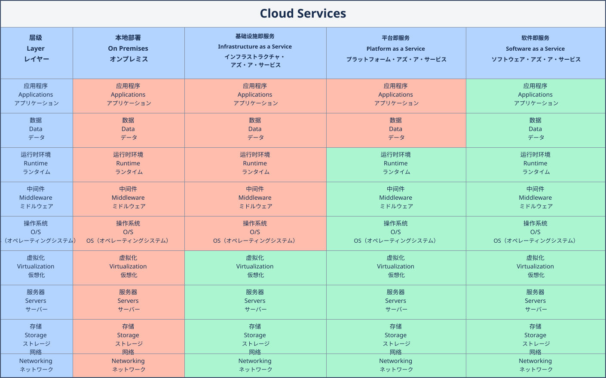

# 01-AWS云服务概要

# 云概念

- 什么是云：真实存在的服务器，租用服务器，数据中心。
- 互联网的服务：客户端、服务端、局域网、互联网、云网（云网融合）
- 必学概念知识：region（物理区域隔离），avaliable zone（高可用），data center， Local Zones，Edge Location
- 优势：全球化部署，无需前期花费，弹性分发，敏捷速度，减轻管理成本
- 云种类：公有云，私有云，混合云
- 云服务模式：LaaS，PaaS，SaaS
- 付费模式：pay as you go
- 框架：CA Framework(Cloud Adoption Framework)，WA Framework(Well-Architected Framework)
- SLA服务等级协议：责任共担模型
- 服务：计算、存储、网络、数据库、其他（身份验证、AI大模型、监控、审计、安全合规）
- IT财务模型：capex（资本支出），opex（运营支出）

# 不同类型的云服务

- 基础设施即服务（Infrastructure as a Service, IaaS）：通过因特网完善计算机基础设施获得服务。IaaS把数据中心、基础设施等硬件资源通过web分配给用户。
- 平台即服务（Platform as a Service, PaaS）：将软件研发的平台作为一种服务，以SaaS的模式提交给用户。
- 软件即服务（Software as a Service, SaaS）：通过互联网提供软件的模式，用户无需购买软件，想商户提供基于web的软件来管理企业经营活动。
- 函数即服务（Function as a Service, FaaS）：无服务器架构，不需要关注和管理服务器，直接使用服务即可。

- 【红色】用户管理
- 【绿色】供应商管理

# AWS常见的服务

- 计算：EC2（NSG、NGCL、EFS、ASG、ELB、SLB、lambda）、ECS（EKS、Farget）
- 存储：S3、EFS、EBS
- 安全：API GW、IAM、KMS、WAF
- 网络：GA、Route53（VPC、CF）、VPN
- 数据库：RDS（Aurora、PG、Mysql）、ElastiCache、DynamoDB、Redshift、DMS
- 其他：SNS、SES、SQS
