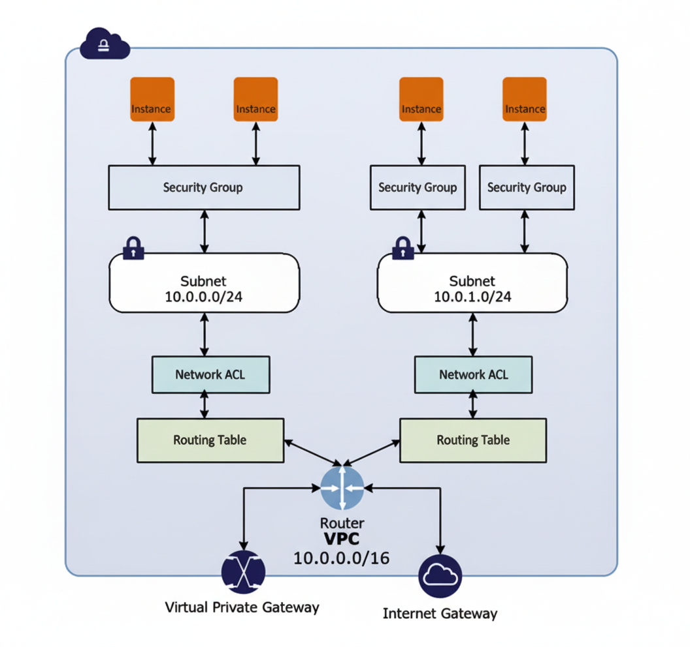
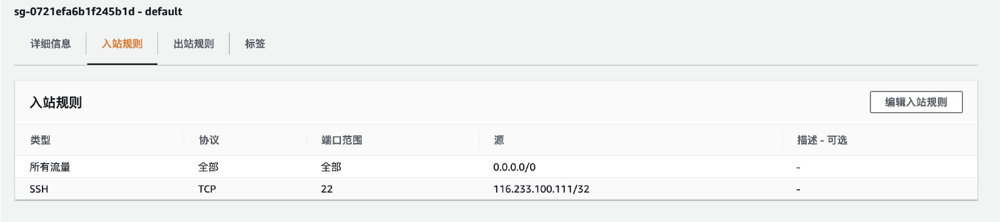
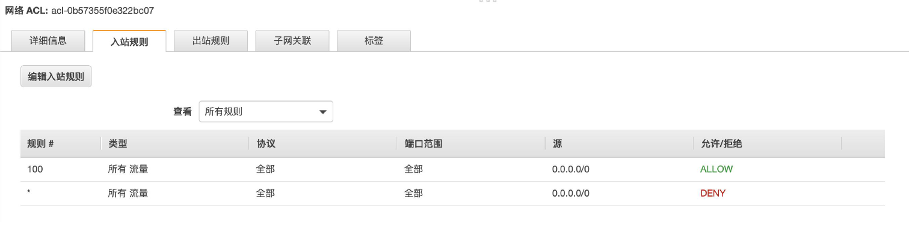

# 03-AWS安全组与NACL

# 安全组与NACL

## 安全组与NACL

- 在专有网络中，**安全组**和**NACL**一起构建分层网络防御。
- **安全组（Security Groups，SG）**，充当虚拟防火墙对于关联实例，在实例级别，控制实例的入站出站的流量。
  - 访问控制列表和网络通信规则。
  - 基于IP通信五元组规则定义：源端口、目的端口、源IP、目的IP、协议。
  - 可分为入站和出站规则。
- **网络访问控制列表(Network Access Control List，NACL)**，充当防火墙关联子网，在子网子别控制入站和出战流量， 控制的是VPC的路由。

## 安全组详细说明

- **在实例级别，而非子网级别。**
  - 子网是在NACL里控制。
- 子网的每一个实例都可以分配不同的安全组，一个实例最多有5个安全组，每个安全组具有60条规则。
- 允许对**入站和出站流量**使用**单独的规则**。
- 可以只**指定允许规则**，但**不指定拒绝规则**。**（只能设置白名单，不能设置黑名单）**
- 可以授予对特定IP、CIDR范围或VPC或对等VPC中的另一个安全组的访问权限(需要VPC对等连接)。
- 是作为一个整体或累积的规则来评估**以最宽松的规则为准**。例如，如果您有一个允许从IP地址203.0.113.1访问TCP端口22(SSH)的规则和另一个允许所有人访问TCP端口22的规则，则每个人都可以访问TCP端口22。
- **安全组是有状态**的，因为它们使用连接跟踪来跟踪进出实例的流量信息

## 安全组重点

- VPC 安全组的基本特征
- 您可以指定允许规则，但不可指定拒绝规则。
- 您可以为入站和出站流量指定单独规则。
- 安全组规则允许您**根据协议和端口号筛选流量**。
- 安全组是**有状态**的。
  - 如果您从实例发送一个请求，则无论入站安全组规则如何，都将允许该请求的响应流量流入。
  - 如果是为响应已允许的入站流量，则该响应可以出站，此时可忽略出站规则。
- 安全组是**立即生效**的。

## **网络访问控制列表(Network Access Control List，NACL)** 详细说明

- **网络ACL(NACL)是VPC的可选安全层，**它充当防火墙用于**控制进出一个或多个子网的流量**。
- NACL是在**子网级别分配的适用于该子网中的所有实例**。
- **入站规则和出站规则各有不同允许或拒绝流量。**
- VPC自带的ACL（默认ACL）允许所有入站和出站流量。
- 新创建的ACL拒绝所有入站和出站流量。
- 可以关联具有多个子网的网络ACL。
- **每一条规则都有编号，按编号顺序执行规则**，从编号最低的规则开始，以确定是否允许流量进出与网络 ACL 关联的任何子网例如。
  - 如果您有一个规则 `100` 和 `110`，设置 `100 为 ALLOW ALL`，`110 为 Deny ALL`，则 `100 Allow ALL` 优先，所有流量都将被允许。
- **是无状态的**；添加入站规则，就必须要添加一条相应的出站规则。

## 安全组与NACL对比
- **位置**
  - **安全组（Security Group）**：工作在**实例级别**，控制单个 EC2 实例的流量。严格来说，安全组关联的是网络接口（ENI），而不是实例本身。
  - **网络 ACL（Network ACL）**：工作在**子网级别**，控制整个子网内所有实例的流量。子网中的所有实例都会经过 NACL 检查。

- **规则**
  - **安全组**：只支持允许（Allow）规则。
  - **网络 ACL**：同时支持允许（Allow）和拒绝（Deny）规则。

- **状态**
  - **安全组**：**有状态（Stateful）**。返回流量会被自动允许，不需要配置额外规则。
  - **网络 ACL**：**无状态（Stateless）**。返回流量必须通过规则明确允许。

- **规则评估方式**
  - **安全组**：在决定是否允许流量前，会对所有规则进行**整体评估**。
  - **网络 ACL**：在决定是否允许流量前，会按照规则编号**逐条评估**。

- **应用范围**
  - **安全组**：
    - 只应用于明确关联该安全组的实例或网络接口。
    - 不过滤来自或去往本地链路地址 `169.254.0.0/16` 的流量。
    - 不过滤来自或去往 AWS 保留 IPv4 地址的流量，包括子网前四个 IPv4 地址和 Amazon VPC DNS 服务。
  - **网络 ACL**：
    - 自动应用于关联子网中的所有实例。

- **典型应用场景**
  - **安全组**：
    - 配置 Web 服务器的对外端口。
    - 限制数据库服务器只允许内部访问。
    - 控制负载均衡器（Load Balancer）与后端应用服务器之间的访问。
    - 配置跳板机（Bastion Host／堡垒机），使内网服务器不直接对外提供服务，只允许通过跳板机中转登录。
  - **网络 ACL**：
    - 在整个子网层面拦截恶意 IP 段。
    - 在多层网络架构中隔离公共子网和私有子网。
    - 根据合规要求，使指定子网完全隔离外网。
    - 在应急响应期间临时封禁整个网段。
