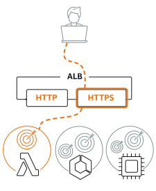
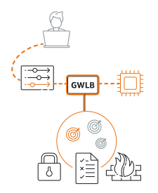
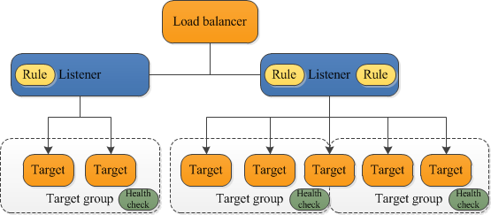
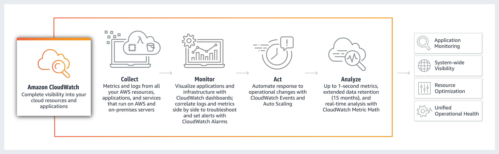

# 04-负载均衡ELB与CloudWatch

# 负载均衡ELB

- **ELB（Elastic Load Balancer）**，可以进行**负载均衡**，还可以**对后端实例进行健康检查**；还能与**自动扩展组（Auto Scaling Group）以及监控服务（CloudWatch）配合**，设置根据后端实例 CPU 使用率的高低，流量大小，处理时间长短等指标，自动完成添加或缩减实例数量。

## **ELB的类型**

- **Application Load Balancer：**如果您使用 **HTTP 和 HTTPS 流量的应用程序**需要灵活的功能集，请选择 Application Load Balancer。Application Load Balancer 在请求级别运行，面向包括微服务和容器在内的应用程序架构提供高级路由功能和可见性功能。
- **Network Load Balancer**：如果您需要**超高性能、大规模分载 TLS、集中部署证书、UDP 支持以及将静态 IP 地址用于应用程序**，请选择网络负载均衡器。网络负载均衡器在连接级别运行，每秒钟能够安全地处理数百万个请求，同时维持超低延迟。
- **Gateway Load Balancer**：如果需要部署和管理一系列**支持 GENEVE 的第三方虚拟设备**，请选择一个 Gateway Load Balancer。这类设备可帮您增强安全性、合规性和策略控制。

## 不同负载均衡器之间的比较

| 功能 | Application Load Balancer | Network Load Balancer                   | Gateway Load Balancer                                           |
| --- | --- |-----------------------------------------|-----------------------------------------------------------------|
| **负载均衡器类型** | 第 7 层 | 第 4 层                                   | 第 3 层网关 + 第 4 层负载均衡                                             |
| **目标类型** | IP、实例、Lambda | IP、实例                                   | IP、实例                                                           |
| **协议侦听器** | HTTP、HTTPS、gRPC | TCP、UDP、TLS                             | IP                                                              |
| **获得方式** | VIP | VIP                                     | 路由表条目                                                           |
| **示意图** |  |  |  |

## 应用程序负载均衡器（**Application Load Balancer**）的功能

- 支持**基于路径的路由**。对于根据请求中的 URL **转发请求的侦听器**，您可以为它配置规则。这让您可以将应用程序构造为较小的服务，并根据 URL 内容将请求路由到正确的服务。
- 支持**基于主机的路由**。对于基于 HTTP 标头中**主机字段转发请求的侦听器**，您可以为它配置规则。这使您能够使用单个负载均衡器将请求路由到多个域。
- 支持**基于请求中的字段进行路由**，例如标准和自定义 HTTP 标头和方法、查询参数和源 IP 地址。
- 支持**将请求路由到单个 EC2 实例上的多个应用程序**。可以使用多个端口向同一个目标组注册每个实例或 IP 地址。
- 支持将请求从一个 URL **重定向**到另一个 URL。
- 支持返回**自定义 HTTP 响应**。
- 支持**通过 IP 地址注册目标**，包括位于负载均衡器的 VPC 之外的目标。
- 支持**将 Lambda 函数注册为目标**。
- 支持负载均衡器在路由请求之前使用应用程序用户的企业或社交身份对这些用户**进行身份验证**。
- 支持**容器化的应用程序**。计划任务时，Amazon Elastic Container Service (Amazon ECS) 可以选择一个未使用的端口，并可以使用此端口向目标组注册该任务。这样可以高效地使用您的群集。
- 支持**单独监控每个服务的运行状况**，因为运行状况检查是在目标组级别定义的，并且许多 CloudWatch 指标是在目标组级别报告的。将目标组挂载到 Auto Scaling 组的功能使您能够根据需求动态扩展每个服务。

## 网络负载均衡器（**Network Load Balancer**）的功能

- 可以**处理急剧波动的工作负载**，并可以**扩展到每秒处理数百万个请求**。
- 支持**将静态 IP 地址用于负载均衡器**。还可以针对**为负载均衡器启用的每个子网分配一个弹性 IP 地址**。
- 支持通过 IP 地址注册目标，包括位于负载均衡器的 VPC 之外的目标。
- 支持**将请求路由到单个 EC2 实例上的多个应用程序**。可以使用多个端口向同一个目标组注册每个实例或 IP 地址。
- 支持**容器化的应用程序**。计划任务时，Amazon Elastic Container Service (Amazon ECS) 可以选择一个未使用的端口，并可以使用此端口向目标组注册该任务。这样可以高效地使用您的群集。
- 支持**单独监控每个服务的运行状况**，因为运行状况检查是在目标组级别定义的，而且许多 Amazon CloudWatch 指标也是在目标组级别报告的。将目标组挂载到 Auto Scaling 组的功能使您能够根据需求动态扩展每个服务。

## 网关负载均衡器（**Gateway Load Balancer**）的功能

- **Gateway Load Balancer 与 AWS Auto Scaling 组协同工作，允许您为虚拟设备实例设置目标利用率级别**。这确保您在任何时候都有最佳的可用资源数量。当流量增加时，将创建更多实例并连接到网关负载均衡器。当流量恢复到正常水平时，这些实例将被终止。
- 网关负载均衡器通过**将流量路由到健康的虚拟设备，并在虚拟设备变得不健康时重新路由流**，确保**高可用性**和**可靠性**。为了确保虚拟设备可用且健康，Gateway Load Balancer 按可配置的节奏对每个虚拟设备实例运行运行状况检查。如果连续失败的测试数量超过设置的阈值，设备将被声明为不正常状态，流量将不再路由到该实例。
- 网关负载均衡器端点是一种新型的 **VPC endpoint**，用于**连接网络流量的源和目的**。它采用 PrivateLink 技术，通过私有连接连接 Internet 网关、vpc 和其他网络资源。你的流量通过 AWS 网络流动，数据永远不会暴露在互联网上。

## 重要组件

- **侦听器：**是一个使用您配置的协议和端口**检查连接请求的进程**。为侦听器定义的**规则可以确定负载均衡器将请求路由到一个或多个目标组中的目标的方式**。
- **负载均衡器：**充当**客户端的单一接触点**。客户端将请求发送到负载均衡器，然后负载均衡器将请求发送到一个或多个可用区中的目标 (例如 EC2 实例)。
- **目标组：每个目标组均用于将请求路由到一个或多个已注册的目标**。创建侦听器时，您为其默认操作指定目标组。流量将转发到在侦听器规则中指定的目标组。

## 图解

## 使用步骤

- 先创建目标组，把服务器添加到目标组。
- 然后创建负载均衡器，转发到目标组。
- 配置负载均衡器的各项要求。

# Amazon CloudWatch

## 简介

- **Amazon CloudWatch** 是一种面向开发运营工程师、开发人员、站点可靠性工程师 (SRE) 和 IT 经理的**监控和可观测性服务**。CloudWatch 为我们提供相关数据和切实见解，以**监控应用程序、响应系统范围的性能变化、优化资源利用率，并在统一视图中查看运营状况**。
- CloudWatch 以**日志、指标和事件的形式收集监控和运营数据**，让我们能够在统一查看在 AWS 和本地服务器上运行的资源、应用程序和服务。我们可以使用 CloudWatch 检测环境中的异常行为、设置警报、并排显示日志和指标、执行自动化操作、排查问题，以及发现可确保应用程序。

## CloudWatch 工作原理

## CloudWatch 的功能

- **收集** - 指标：从 AWS 的服务中收集数据，然后通过 **available statistics** 显示到控制台上
  - 内置指标
  - 自定义指标
- **监控** - 警报：通过对指标的判断，可以发出邮件，或执行 auto scaling
  - 通过控制面板查看统一运作视图
  - 高精度警报
  - 关联日志和指标
  - 异常检测
- **操作** - 对事件处理的功能：通过 EC2 实例或其他服务触发，调用到其他的服务，比如调用 lambda
  - Auto Scaling
  - CloudWatch Events 自动响应操作更改
  - 联动 EKS、ECS 和 k8s 集群上发出警报并自动执行操作
- **分析** - 日志：会将 lambda/RDS 等执行的日志放到 log 中，方便处理
  - 日志分析
  - Lambda 指标、日志和轨迹分析
