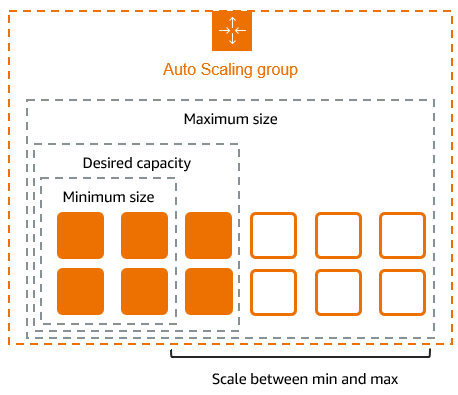
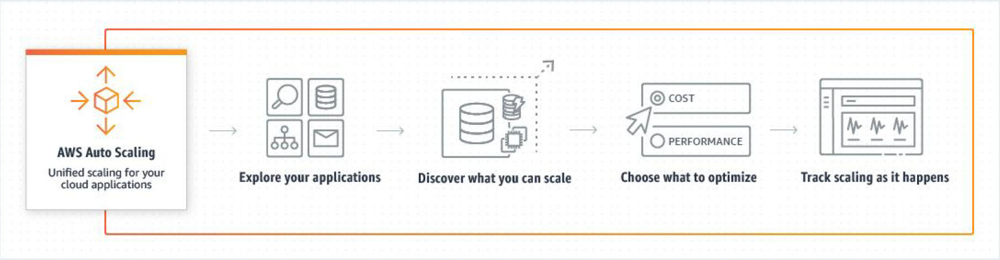
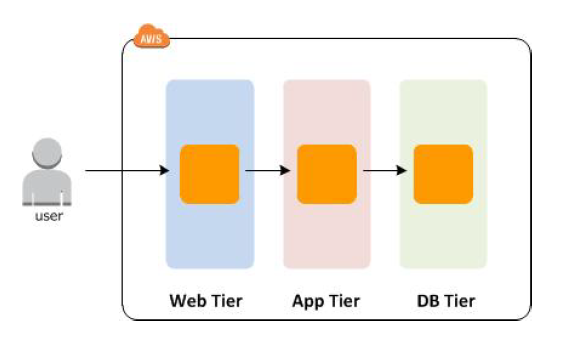
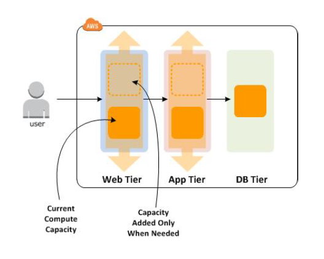
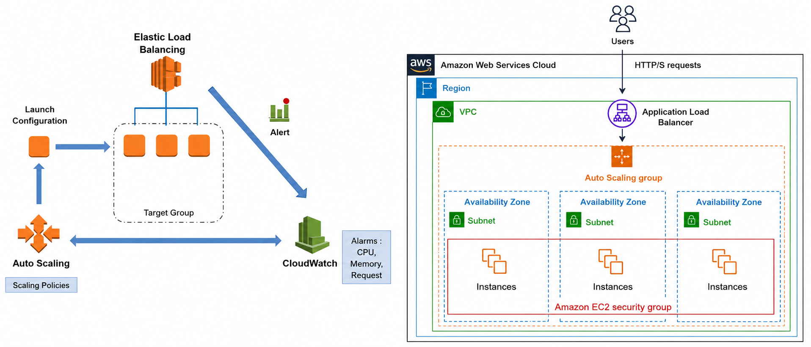
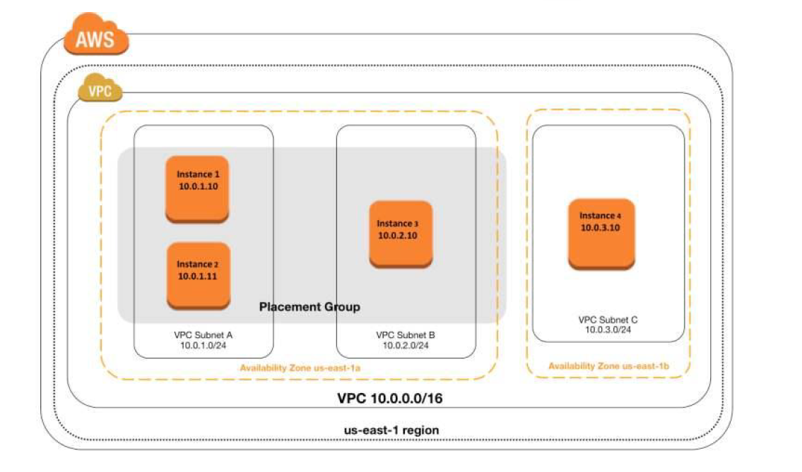
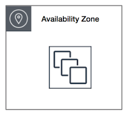
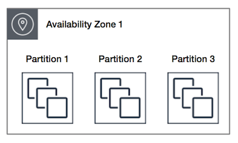
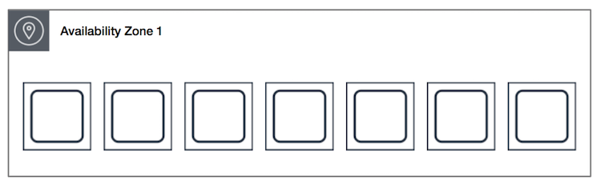

# 05-弹性伸缩与置放群组

# 弹性伸缩（Auto Scaling）

**AWS Auto Scaling** 可以**监控您的应用程序并自动调整容量**，从而以**尽可能低的成本来保持稳定、可预测的性能。**使用 AWS Auto Scaling，您可以在几分钟内为多项服务中的多个资源轻松设置应用程序扩展。

## 工作原理

## Amazon Auto Scaling 优势

- **提高容错能力：** Amazon EC2 Auto Scaling 可以检测到实例何时运行状况不佳并终止实例，然后启动新实例以替换它。您还可以配置 Amazon EC2 Auto Scaling 以使用多个可用区。如果一个可用区变得不可用，则 Amazon EC2 Auto Scaling 可以在另一个可用区中启动实例以进行弥补。
- **提高了可用性：** Amazon EC2 Auto Scaling 有助于确保应用程序始终具有合适的容量以满足当前的流量需求。
- **加强成本管理：** Amazon EC2 Auto Scaling 可以根据需要动态地增加或降低容量。由于您仅为使用的 EC2 实例付费，您可以在需要的时候启动实例，并在不需要的时候终止实例以节约成本。

## Amazon Auto Scaling 扩展选项

- **始终保持当前实例级别：**您可以配置 Auto Scaling 组，使其**始终保持指定的运行实例数**。
- **手动缩放：**手动扩展是扩展资源的最基本方法，您只需指定 Auto Scaling 组的**最大容量、最小容量或所需容量的变化**。
- **按计划扩展：**按计划扩展意味着扩展操作作为**时间和日期的函数自动执行**。这在您确切地知道何时增加或减少组中的实例数量时非常有用
- **根据需求进行扩展：**使用**动态扩展**是一种更高级的资源扩展方法，您可以定义扩展策略，该策略可以动态调整 Auto Scaling 组的大小以满足需求的变化。例如，假设您有一个当前在两个实例上运行的 Web 应用程序，并希望在应用程序负载变化时将 Auto Scaling 组的 CPU 使用率保持在 50% 左右。在根据条件变化进行扩展，但却不知道条件何时改变时，可以使用这种方法。
- **使用预测式扩展：**您还可以将**预测扩展和动态扩展**（分别为主动和被动方法）**结合起来**更快地扩展您的 Amazon EC2 容量。

## Amazon Auto Scaling 组件

- **Groups：**您的 EC2 实例整理到组中，从而当作一个逻辑单位进行扩展和管理。当您创建一个组时，您可以指定其中 EC2 实例的最**小数量、最大数量以及所需数量**。
- **配置模板：**您的组将**启动模板或启动配置作为其 EC2 实例的配置模板**。您可以为实例指定一些信息，例如，AMI ID、实例类型、密钥对、安全组和块储存设备映射。
- **扩展选项：**Amazon EC2 Auto Scaling 提供了**多种扩展 Auto Scaling 组的方式**。例如，您可以将组配置为在发生指定条件时（动态扩展）或根据时间表进行扩展。

## Amazon Auto Scaling 横向扩展与纵向扩展

| Scaling Out                                           | Scaling                                           |
|-------------------------------------------------------|---------------------------------------------------|
| **横向扩展（水平扩展），用更多的节点支撑更大量的请求。**                        | **纵向扩展（垂直扩展），扩展一个节点的能力以支撑更大的请求。**                 |
| 实际案例：双 11 大促时增加机器，活动结束后减少机器。（无状态、多实例并行）               | 实际案例：为数据库服务器增加 CPU 核数和内存。（实际通常是更换新机器，而不是在原有机器上操作） |
|  |   |

## 概念图解（Auto Scaling Gourp, Load Balancer, CloudWatch）

- 先建好 **Auto Scaling Group**（定义启动模板：用什么 AMI、什么规格、最小/最大/期望实例数）
- 把这个 Auto Scaling Group **关联**到一个 **Load Balancer**（这样新增/减少的实例会自动加入/移出负载均衡器的分流名单）
- 在 Auto Scaling Group 上配置**扩展策略（Scaling Policy）**，指定依据哪个 **CloudWatch 指标**（比如平均 CPU、请求数）、达到什么阈值时，加/减多少实例

# 置放群组

## 概念

在启动新的 EC2 实例时，EC2 服务会尝试以某种方式放置实例，以便**将所有实例分布在基础硬件上以最大限度减少相关的故障**。我们可以使用置放群组 —— 一组相互依赖的实例，从而满足我们的不同工作负载需求。

## 置放群组的置放策略

| 集群（Cluster）置放群组   | 分区（Partition）置放群组                                                                                                                                                                                                                                                  | 分布（Spread）置放群组                                                                                   |
|----------------------------------------------------------------------------------------------------------------------------------------------------------------------------------------------------------------------------------------|--------------------------------------------------------------------------------------------------------------------------------------------------------------------------------------------------------------------------------------------------------------------|--------------------------------------------------------------------------------------------------|
| 集群——**将一个可用区中靠近的实例打包在一起**。通过该策略，工作负载可以获得所需的**低延迟网络性能**，满足 HPC 应用通常采用的**紧密耦合节点间通信**要求。  **工作特性**  • 是单个可用区中实例的逻辑分组。 • 可以横跨同一区域中的**对等 VPC（Peered VPCs）**。 • 实例处于网络中同一高等分带宽段；同一集群置放群组中的实例可针对 TCP/IP 流量获得**更高的单流吞吐量限制**。 | 分区——**将实例分布在不同的逻辑分区上**，使一个分区中的实例组不会与其他分区中的实例组使用相同的基础硬件。该策略通常用于**大型分布式工作负载**和**重复工作负载**，例如 Hadoop、Cassandra 和 Kafka。  **工作特性**  • Amazon EC2 将每个群组划分为多个称为“分区”的逻辑段。 • EC2 确保每个分区拥有独立的一组机架，而且每个机架具有独立的网络和电源。置放群组中的任意两个分区**不会共享相同的机架**，从而在应用层隔离硬件故障的影响。 | 分布——将一小组实例**严格放置在不同的基础硬件上，以减少相关故障**。  **工作特性**  • 严格将每个实例放置在各自独立的机架上，每个机架拥有专用的网络和电源。 |
|  |    |                                                           |

## 置放群组注意事项

- 对置放群组中的所有实例使用相同的实例类型。AWS建议在一个Placement Group内的所有**EC2实例是一模一样**的，**否则会有短板效应**
- 不可以将一个正在运行的EC2实例放到一个EC2 Placement Group中
- 如果在Placement Group中创建实例的时候出现“**capacity error**”的错误，可以**停止再启动组中的所有实例，再重新创建刚才的实例。**
- 如停止置放群组中的某个实例，然后重启该实例，则其仍将在该置放群组中运行。但是，如果没有足够容量可用于该实例，则启动将会失败。
- **分布置放群组可以跨越同一区域中的多个可用区。**每个群组在每个可用区中最多有7个正在运行的实例。
- 如果在分布置放群组中启动实例，并且**没有足够的独特硬件来满足请求，请求将失败**。

## 置放群组规则及限制

### **一般规则及限制**（通用性规则）

- 置放群组指定的名称在您的区域 AWS 账户中必须是唯一的。
- 不能合并置放群组。
- 一次可在一个置放群组中启动一个实例；实例不能跨多个置放群组。
- 无法在置放群组中启动专用主机。

### **特定规则及限制**（特殊性规则）

- **集群置放群组规则和限制**
  - 集群置放群组中的实例必须为**受支持的实例类型**。
  - 一个集群置放群组**不能跨过多个可用区**。
  - 集群置放群组中的两个实例之间的**最大网络吞吐量流量速度受两个实例中的较慢实例限制**。对于具有高吞吐量要求的应用程序，请选择其网络连接满足您要求的实例类型。
  - 可以**将多种类型的实例启动到集群置放群组中**。不过，这**会降低提供所需容量以成功完成启动的可能性**。**AWS 建议集群置放群组中的所有实例使用相同的实例类型。**
- **分区置放群组规则和限制**
  - 对于每个可用区，**一个分区置放群组最多支持 7 个分区**。您可在分区置放群组中启动的实例的数量仅受账户限制的限制。
  - **在一个分区置放群组中启动实例时，Amazon EC2 将尝试跨所有分区均匀分发实例，但是不保证跨所有分区均匀分发实例。**
  - 具有**专用实例的分区置放群组最多可具有 2 个分区**。
- **分布置放群组规则和限制**
  - 分布置放群组**最多支持为每个可用区运行 7 个实例**。
    - AWS 官方说明：例如，在具有三个可用区的区域中，您可以在组中总共运行 21 个实例（每个区域 7 个）。如果您尝试在同一可用区和同一个分布置放群组中启动第八个实例，则该实例将无法启动。如果您需要在可用区中拥有七个以上的实例，则建议使用多个分布置放群组。使用多个分布置放群组并不能保证实例在组之间分布，但可确保每个组的分布，从而限制某些故障类别的影响。
  - **专用实例不支持分布置放群组**。
