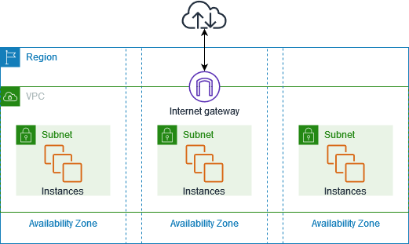
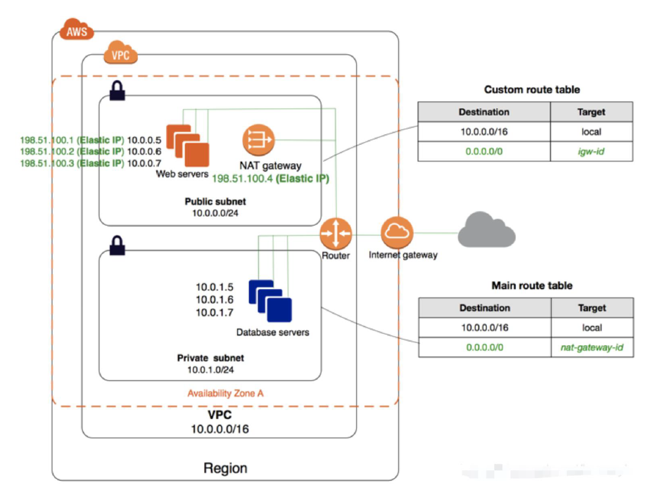
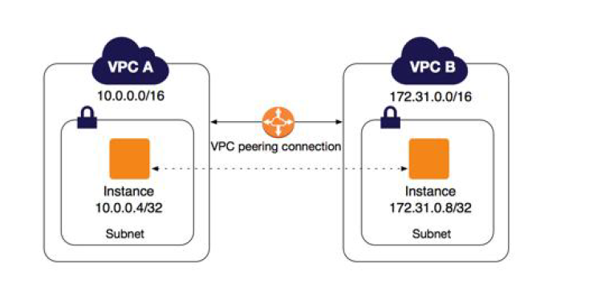
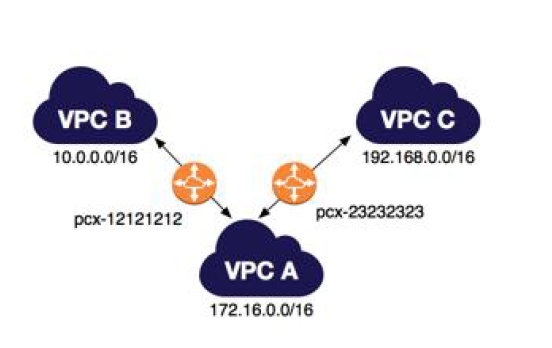
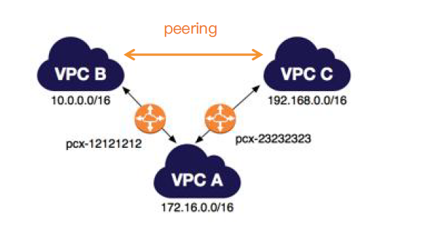
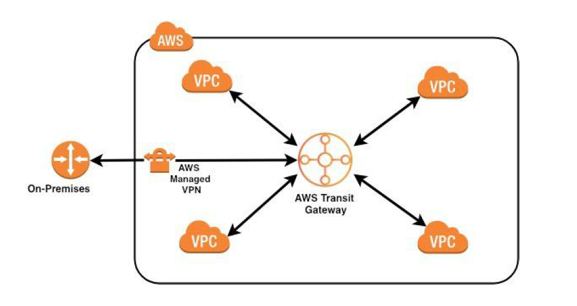

# 06-VPC与对等连接

# VPC是什么

## VPC（Virtual Private Cloud）虚拟私有云

**VPC（Virtual Private Cloud）虚拟私有云**，是AWS提供的在网络层面针对资源进行分组的技术，一个VPC可以看作是一个独立的虚拟网络，这个虚拟网络与客户在数据中心运营的传统网络及其相似，并会为客户提供使用AWS的可扩展基础设施的优势，默认情况下VPC与VPC之间不互通，是逻辑上的隔离。

## VPC的必要组件及可选组件

### 必要组件

- 子网 (Subnets)
- 路由表 (Route tables)
- DHCP 选项集（Dynamic Host Configuration Protocol（DHCP）option sets）
- 安全组 (Security Group)
- 网络 ACL（Network Access Control List（ACLs））

### 可选组件

- 互联网网关 (Internet Gateways（IGW）)
- 弹性 IP（Elastic IP（EIP）address）
- 弹性网卡 (Elastic Network Interfaces（ENIs）)
- 终端节点 (Endpoints)
- 对等连接 (Peering)
- NAT 网关 (Network Address Translation（NATs）instances and NAT gateways)

## 子网（Subnet） & 路由表（Route Tables）

### Subnet

- 一个 VPC 可以包含**多个子网，一个子网对应于一个可用区（AZ）。**
- 子网 CIDR 确定后，前 4 个 IP 和最后 1 个 IP 不可用，AWS 内部使用，例如：/27 有 32 个 IP，去掉 5 个后，我们能使用 27 个。
- **AZ 是物理上的隔离，由于 VPC 可以跨多个 AZ，因此 VPC 是逻辑上的划分。**
- **VPC 中的 subnet 永远是互通的，因为任何一个路由表都有包含一个本地路由，且不可删除。**
- 在创建 subnet 的时候可以指定默认是否为每个新的 instance 分配 public IP。
- Subnet 有两种
  - **Public subnet**，在路由表中有一个指向 IGW 的路由。
  - **Private subnet**，在路由表中没有指向 IGW 的路由。

### Route Tables

- **路由表，用于确定子网中路由的去向。**
- **一个子网只能且必须对应一个 route table，一个 route table 可对应多个子网。**

## 网关（Internet gateways） & 网络地址转换（NAT）

### Internet gateways

- Internet 网关是一种**横向扩展、支持冗余且高度可用的 VPC 组件**，可实现 **VPC 中的实例与 Internet 之间的通信**。因此它**不会对网络流量造成可用性风险或带宽限制。**
- Internet 网关有**两个用途**：
  - 一个是在 **VPC 路由表中为 Internet 可路由流量提供目标**。
  - 另一个是**为已经分配了公有 IPv4 地址的实例执行网络地址转换 (NAT)**。
- **一个 VPC 只能有一个 IGW，用于连接 internet。**

### NAT (Network Address Translation)

- **NAT Instances and NAT Gateways**
- **将 IP 数据包头中的 IP 地址转换为另一个 IP 地址的过程**。
  - 在实际应用中，**NAT 主要用于实现私有网络访问公共网络的功能**。这种通过使用少量的公有 IP 地址代表较多的私有 IP 地址的方式，将**有助于减缓可用 IP 地址空间的枯竭**
- 都是**用于 private 子网中的 instance 与外界通讯的技术，可以访问外网，但外网无法穿透到 instance**
- 官方建议使用 NAT Gateways，NAT Instances 逐渐淘汰。

## 安全组（Security Group） & 网络控制列表（ACL）

### Security Group

- 安全组，通过创建规则来设置虚拟防火墙，**在实例层面控制网络访问**。
- 安全组可以**设置允许规则**，但不能设置拒绝规则。
- 默认没有入站规则，除非手动增加，**默认允许所有出站**。
- **安全组是有状态的，且可以随时修改安全，修改后立即生效。**

### Network Access Control List（ACLs）

- **在子网层面控制网络访问，默认都允许。**
- **支持允许和拒绝。**
- **没有状态，需要同时指定出入站规则。**
- **颗粒度为整个子网。**

## 公有子网与私有子网的区别

**公有子网中的实例可直接将出站流量发往 Internet**，而私有子网中的实例不能这样做。但是，**私有子网中的实例可使用位于公有子网中的网络地址转换 (NAT) 网关访问 Internet** (不建议使用 NAT 实例)。**数据库服务器可以使用 NAT 网关连接到 Internet 进行软件更新，但 Internet 不能建立到数据库服务器的连接。**

# 操作使用 VPC

- 创建VPC
  - IPv4 CIDR块 手动输入，一般是 `10.0.0.0/16`
  - IPv6 CIDR 数据块，保持默认。
- 创建共有子网、私有子网，IPv4 VPC CIDR 块的值是 `10.0.0.0/16`，IPv4 子网 CIDR 块的值是 `10.0.1.0/24`
- 创建互联网网关，把 VPC 添加到网关里。
- 创建路由表，选择已创建的VPC。
- 公有路由表关联公有子网。私有路由表关联私有子网。
- 在路由表里，关联对应的子网。
- 在共有路由表里，添加路由 `0.0.0.0/0`，选择 `互联网网关`，值是刚创建的互联网网关。私有路由表里，不添加网关。

# 对等连接（VPC Peering）

## 对等连接（AWS VPC Peering）

**VPC 对等连接是两个 VPC 之间的网络连接**，通过此连接，您可以使用私有 IPv4 地址或 IPv6 地址**在两个 VPC 之间路由流量**。这两个 VPC 中的**实例可以彼此通信**，就像它们在同一网络中一样。您可以在自己的 VPC 之间创建 VPC 对等连接，或者在自己的 VPC 与其他 AWS 账户中的 VPC 之间创建连接。**VPC 可位于不同区域内（也称为区域间 VPC 对等连接）**。

## VPC对等连接的特性

- **对等连接不具备传递性**：VPC 对等连接是两个 VPC 之间的一对一关系。您可以为您的每个 VPC 创建多个 VPC 对等连接，但是不支持传递的对等关系。您不会与您的 VPC 不直接对等的 VPC 形成任何对等关系。**对等连接数=n(n-1)/2，n是VPC的个数。**

## VPC对等限制

- 您无法在具有匹配或重叠的 IPv4 或 IPv6 CIDR 块的 VPC 之间创建 VPC 对等连接。Amazon 将始终为您的 VPC 分配唯一的 IPv6 CIDR 块。**如果您的 IPv6 CIDR 块唯一但 IPv4 块不唯一，则无法创建对等连接**。
  - **CIDR（Classless Inter-Domain Routing，无类域间路由）** 是一种 IP 地址表示方式，用来指定 IP 地址区段，格式一般为：`IP地址/前缀长度`。
  - IPv4: `10.0.0.0/16`、`192.168.1.0/24`
  - IPv6: `2406:da14:abcd::/56`
- VPC 对等不支持传递的对等关系。在 VPC 对等连接中，您的 VPC 无权访问对等 VPC 可能与之对等的任何其他 VPC。其中包括完全在您自己的 AWS 账户内建立的 VPC 对等连接。
- 您**不能在相同两个 VPC 之间同时建立多个 VPC 对等连接**。
- **不支持在 VPC 对等连接中进行单一地址反向传输路径转发**。
- 您可以让 VPC 对等连接两端的资源通过 IPv6 相互通信；不过，IPv6 通信不是自动的。您必须为每个 VPC 关联一个 IPv6 CIDR 块，允许 VPC 中的实例进行 IPv6 通信，并在您的路由表中添加路由以将针对对等 VPC 的 IPv6 流量路由到 VPC 对等连接。

## VPC费用

- **在同一 AWS 区域内传输数据**，对于从 Amazon EC2、Amazon RDS、Amazon Redshift、Amazon DynamoDB Accelerator (DAX) 和 Amazon ElastiCache 实例或同一 AWS 区域内各可用区或 VPC 对等连接之间的弹性网络接口 “传入” 和 “传出” 的数据，每个方向均按 **0.01 USD/GB** 的标准收费。
- **IPv4**：对于从公有或弹性 IPv4 地址 “传入” 和 “传出” 的数据，每个方向均按 **0.01 USD/GB** 的标准收费。
- **IPv6**：对于从其他 VPC 中的 IPv6 地址 “传入” 和 “传出” 的数据，每个方向均按 **0.01 USD/GB** 的标准收费。
- 在同一可用区中的 Amazon EC2、Amazon RDS、Amazon Redshift、Amazon ElastiCache **实例和弹性网络接口之间传输数据是免费的**。**当使用 VPC 对等连接传输数据时，请参阅官方费用文档。**
- 在同一 AWS 区域中的 Amazon S3、Amazon Glacier、Amazon DynamoDB、Amazon SES、Amazon SQS、Amazon Kinesis、Amazon ECR、Amazon SNS、Amazon SimpleDB 和 Amazon EC2 实例之间传输数据是**免费**的。**通过 PrivateLink 终端节点访问的 AWS 服务将产生标准 PrivateLink 费用，如此处所述**。
- 使用**私有 IP 地址**从 Amazon Classic Elastic Load Balancer 和 Amazon Application Elastic Load Balancer，以及在同一 AWS 区域中的 EC2 实例和负载均衡器之间 “传入” 和 “传出” 数据是**免费**的。

# 中转网关（Transit Gateway）

## AWS Transit Gateway

- AWS Transit Gateway **通过中央枢纽连接 VPC 和本地网络**。这简化了您的网络，并且结束了复杂的对等关系。它用作云路由器 – 每个新连接都只进行一次。
- **中转网关 充当区域虚拟路由器，用于路由在您的 Virtual Private Cloud (VPC) 和 VPN 连接之间流动的流量**。中转网关根据网络流量的规模灵活地进行扩展。通过**中转网关进行路由是在第 3 层运行**的，其中，数据包根据其目的地 IP 地址发送到特定的下一个跃点挂载。
- **不需要专用网络（Direct Connect），普通网络就可以。**

## Transit Gateway 支持连接的资源

Transit Gateway 挂载同时**是数据包的源**和**目的地**。您可以**将以下资源附加到中转网关**：

- 一个或多个 VPC
- 一个或多个 VPN 连接
- 一个或多个 AWS Direct Connect 网关
- 一个或多个中转网关对等连接

如果您附加了中转网关对等连接，则中转网关必须位于其他区域中。
